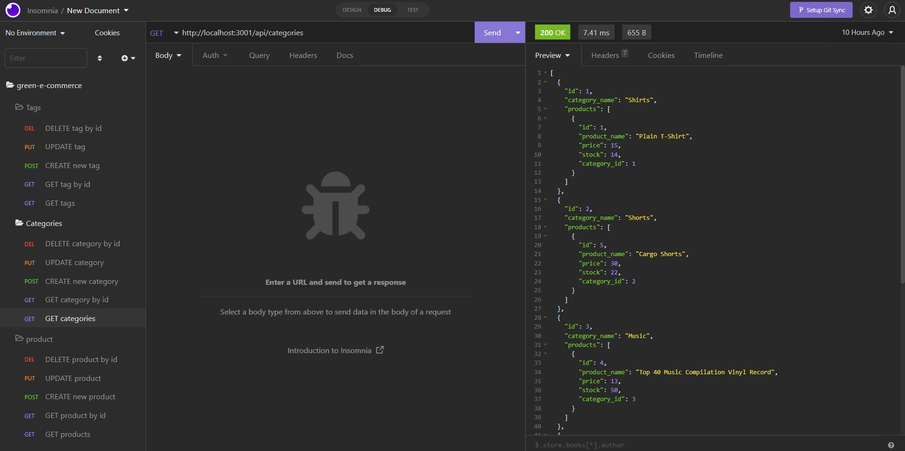

# green-e-commerce

## Description
This project is to create an e-commerce back end using a working express.js api and configure it to use Sequelize to interact with a mysql database. I defined the columns in the models for the seed information. I created GET, POST, PUT, and DELETE routes for the category routes, product routes, and tag routes. After creating the schema using mysql I seeded the data using npm run seed and to run the server npm start. I then ran a demo of the routes using insomnia. In insomnia I was able to show how to GET all the sections or GET just 1 section by id. I was able to POST a new section to the database and do a PUT to update a section. In the end I was able to DELETE all of the changes I had made.
## Table of contents
- [Mock-up](#Mock-up)
- [Installation](#Installation)
- [Usage](#Usage)
- [Contribution](#Contributing)
- [Test](#Test)
- [Questions](#Questions)
- [Diployment Links](#Questions)
## Mock-up

## Installation
dotenv

express

mysql2

sequelize
## Usage
source schema.sql

npm run seed

npm start
## Contributing
Steven Green
## Test
insomnia
## Questions
GitHub Username: [mrgreen12375](https://github.com/mrgreen12375)

Email Address: [ste2144105@gmail.com](ste2144105@gmail.com)
## Deployment Links
Screencastify: https://drive.google.com/file/d/1doMh152Xa486DoWxq28nRBZEa2YC7Qja/view

GitHub Repo: https://github.com/mrgreen12375/green-e-commerce